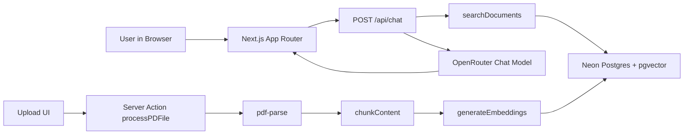
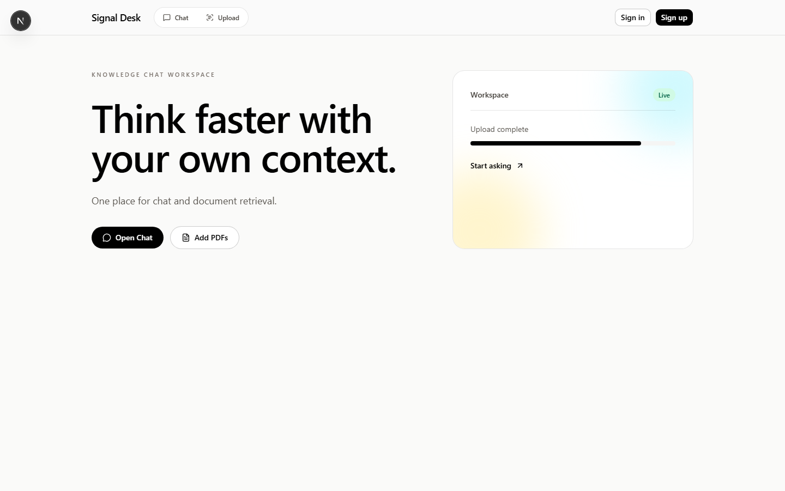
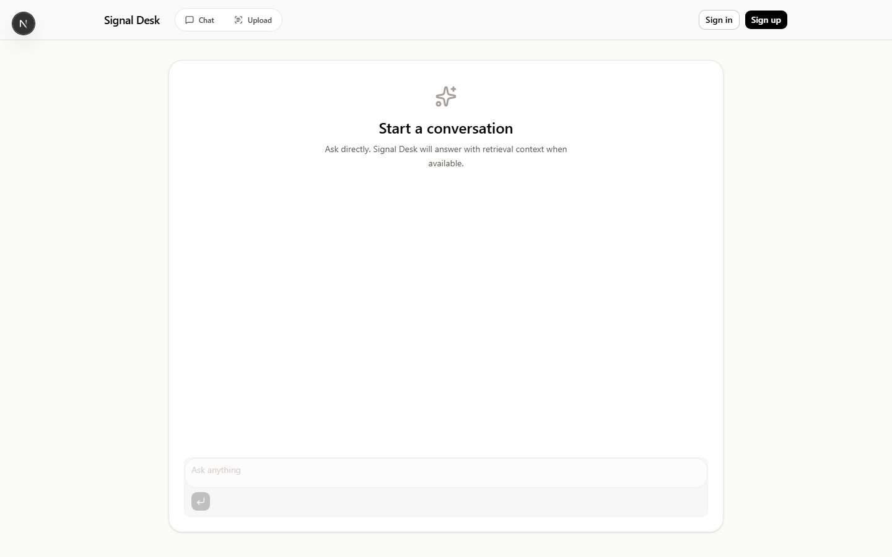
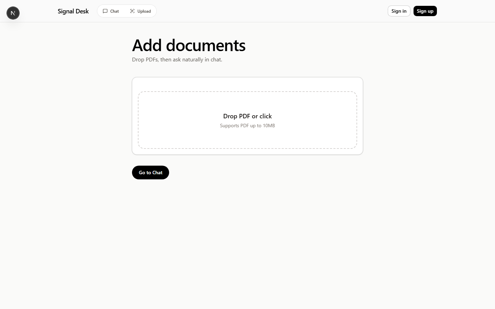

# Signal Desk

Signal Desk is a product-style AI workspace where users can:

- chat with a free LLM through OpenRouter
- upload PDF files
- retrieve relevant chunks from a vector database during chat

The result is a lightweight RAG assistant with a polished UI and minimal workflow friction.

## Quickstart

```bash
npm install
```

Create .env.local:

```env
OPENROUTER_API_KEY=your_openrouter_api_key
OPENROUTER_SITE_URL=http://localhost:3000
OPENROUTER_APP_NAME=signal-desk
NEON_DATABASE_URL=postgresql://...
NEXT_PUBLIC_CLERK_PUBLISHABLE_KEY=pk_...
CLERK_SECRET_KEY=sk_...
```

```bash
npx drizzle-kit push
npm run dev
```

Open [http://localhost:3000](http://localhost:3000).

## Product Overview

Signal Desk combines three core experiences:

- Conversational assistant: streaming responses in a clean chat interface
- Knowledge ingestion: PDF upload, parsing, chunking, embedding generation
- Retrieval grounding: semantic search over stored chunks to enrich responses

## Key Features

- OpenRouter chat integration using a free instruct model
- Retrieval-augmented generation pipeline for document-grounded answers
- PDF parsing and chunking pipeline
- pgvector storage with cosine similarity search
- Clerk-ready authentication UI in the top navigation
- Responsive, navbar-first, minimal UI system

## Tech Stack

- Framework: Next.js 16, React 19, TypeScript
- AI SDK: Vercel AI SDK + OpenRouter provider
- Embeddings: OpenRouter free embedding model with dimension normalization
- Database: Neon Postgres + pgvector
- ORM: Drizzle ORM + Drizzle Kit
- Auth/UI: Clerk + Tailwind CSS v4 + shadcn components

## Architecture

### System Diagram



High-level request flow:

1. User sends a message from chat UI.
2. API route extracts latest user query.
3. Query embedding is generated.
4. Similar document chunks are fetched from Postgres via cosine similarity.
5. Retrieved context is injected into the system prompt.
6. Response is streamed back to the client.

Document ingestion flow:

1. User uploads a PDF.
2. Server action parses text from PDF.
3. Text is split into chunks.
4. Embeddings are generated for each chunk.
5. Chunks + vectors are inserted into documents table.

## Screenshots and Demo

### Landing



### Chat



### Upload



### Demo

Demo video: [docs/demo/signal-desk-flow.webm](docs/demo/signal-desk-flow.webm)

Suggested capture order:

1. Landing page with navbar
2. Uploading a PDF
3. Asking a grounded question in chat
4. Streaming response with retrieval context

## Project Structure

- [app/page.tsx](app/page.tsx): landing page
- [app/chat/page.tsx](app/chat/page.tsx): chat experience
- [app/upload/page.tsx](app/upload/page.tsx): document upload UI
- [app/api/chat/route.ts](app/api/chat/route.ts): streaming chat API + retrieval context injection
- [app/upload/action.ts](app/upload/action.ts): PDF processing server action
- [lib/chunking.ts](lib/chunking.ts): text chunking logic
- [lib/embeddings.ts](lib/embeddings.ts): embedding generation and normalization
- [lib/search.ts](lib/search.ts): semantic retrieval query
- [lib/db-schema.ts](lib/db-schema.ts): vector table schema
- [components/navigation.tsx](components/navigation.tsx): global navbar

## Local Setup

### 1. Install dependencies

```bash
npm install
```

### 2. Configure environment variables

Create .env.local in the project root:

```env
# OpenRouter
OPENROUTER_API_KEY=your_openrouter_api_key
OPENROUTER_SITE_URL=http://localhost:3000
OPENROUTER_APP_NAME=signal-desk

# Database (Neon / Postgres)
NEON_DATABASE_URL=postgresql://...

# Clerk (required for auth components in navbar)
NEXT_PUBLIC_CLERK_PUBLISHABLE_KEY=pk_...
CLERK_SECRET_KEY=sk_...
```

### 3. Enable pgvector extension

Run this once on your database:

```sql
CREATE EXTENSION IF NOT EXISTS vector;
```

### 4. Push schema

```bash
npx drizzle-kit push
```

### 5. Run app

```bash
npm run dev
```

Open [http://localhost:3000](http://localhost:3000).

## Available Scripts

- npm run dev: start development server
- npm run build: production build
- npm run start: run production server
- npm run lint: run linting

## API and Retrieval Notes

- Chat endpoint: POST /api/chat
- Retrieval is handled server-side in the chat route by calling semantic search before model generation.
- Tool calling is intentionally not used in chat requests to remain compatible with free model routing.

## Data Model Notes

The documents table stores:

- id
- content
- emdeddings (vector)

Important: the column name is currently emdeddings (spelling preserved to match current schema and code). Keep this naming consistent unless you run a dedicated migration.

## Troubleshooting

- Error: missing OpenRouter key
  - Add OPENROUTER_API_KEY to .env.local

- Error: vector dimension mismatch
  - Ensure schema is pushed and embedding normalization is active

- Error: tool use endpoint not found
  - Current implementation avoids tools and uses prompt-level context injection

- Drizzle cannot connect
  - Verify NEON_DATABASE_URL and database network settings

## Deployment

Recommended: Vercel for app hosting + Neon for Postgres.

Before deploy:

1. Set all environment variables in hosting provider
2. Confirm pgvector extension exists in production database
3. Run migration/schema push against production DB

## Roadmap

- Source citations in chat output
- Query caching for repeated prompts
- Better ingestion status and progress UX
- Optional conversation history persistence

## License

This project is currently unlicensed. Add a LICENSE file to define usage terms.
